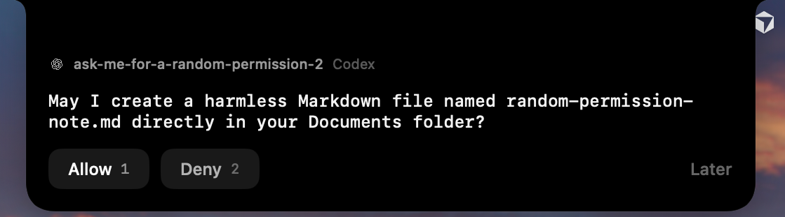
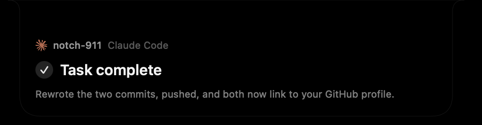
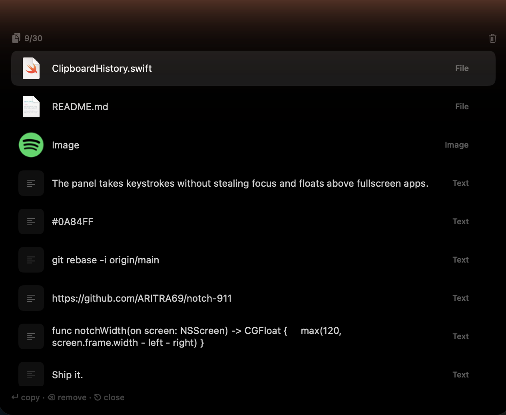
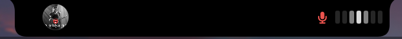
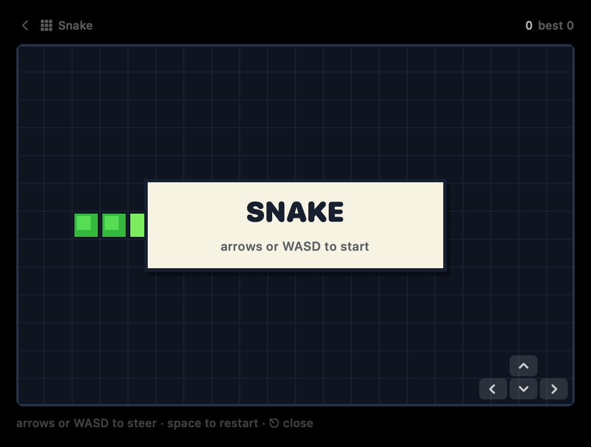
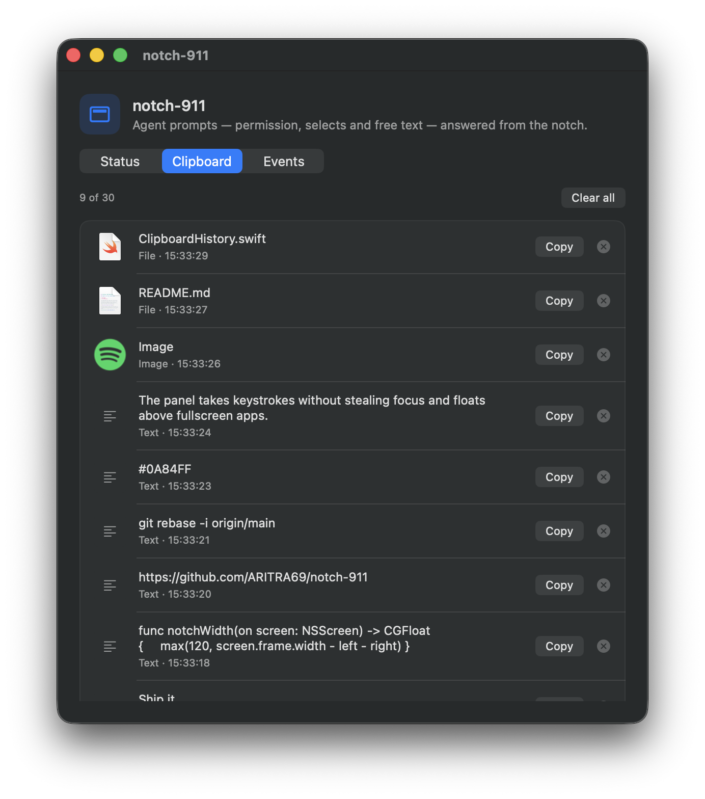

<div align="center">


# notch-911

**Answer your coding agents from the MacBook notch.**


&nbsp;&nbsp;

&nbsp;&nbsp;

&nbsp;&nbsp;

&nbsp;&nbsp;


macOS 14+ &nbsp;·&nbsp; Swift 6 &nbsp;·&nbsp; SwiftUI + AppKit &nbsp;·&nbsp; [MIT](LICENSE)

</div>

---

Claude Code and Codex both stop and wait for you — for permission, for a choice,
for a plan-mode answer. notch-911 puts those prompts in the notch, so you answer
them without leaving the window you were already in. While nothing is asking,
the same surface shows what's playing, holds a shelf of files you're moving
between apps, and keeps the last 30 things you copied.

<div align="center">
  
</div>

---

## Install

[**Download the latest DMG**](https://github.com/ARITRA69/notch-911/releases/latest)
from Releases, open it, and drag **notch-911** into **Applications**.

Two things to know, both consequences of this app being unsigned and
un-notarized — there is no paid Apple Developer account behind it:

**macOS will refuse to open it at first.** Gatekeeper only trusts apps
notarized by Apple, so the first launch is blocked with a claim that the app
"is damaged" or "can't be checked for malicious software". It isn't damaged —
it just carries the quarantine flag every downloaded file gets. Remove the
flag once and the app opens normally from then on:

```sh
xattr -dr com.apple.quarantine /Applications/notch-911.app
```

**Accessibility needs re-granting after each update.** macOS ties the
Accessibility permission (used for Direct Codex answers) to the app's code
signature, and an unsigned app has no stable identity across versions, so the
grant silently stops working after an update. Fix: in **System Settings →
Privacy & Security → Accessibility**, remove notch-911 with the **−** button,
then add it back with **+**.

The app checks GitHub for a newer release once a day and, when one exists,
shows **Update Available** in the notch-911 application menu — it only opens
the release page in your browser, nothing downloads itself.

---

## What it does

### Agent prompts, in the notch

A hook fires, the notch opens, you answer, the agent unblocks. Four shapes are
supported, covering everything the two agents can actually put in front of you:

| Prompt | Channel | Claude Code | Codex |
| --- | --- | :---: | :---: |
| Allow / deny | `PermissionRequest` hook / rollout | ✅ | ✅ |
| Selects + **Other** | `AskUserQuestion` hook | ✅ | — |
| Selects + text fields | `Elicitation` hook | ✅ | — |
| Free text | `Stop` hook | ✅ | ✅ |
| Turn finished | `Stop` hook / rollout | ✅ | ✅ |

Claude Code's column is all hooks. Codex's is not: its hooks are registered and
have never once fired — its own `hook_runtime` logger is empty against 21k rows
of other logging — so everything in the Codex column that works, works by
observation instead. How, per row, is described below.

The panel takes keystrokes without stealing focus and floats above fullscreen
apps, so answering never switches your active window.

<div align="center">
  
  <br>
  <sub>An <code>Elicitation</code> form — one single-select group, one
  multi-select group, every option on its own Command-number shortcut.</sub>
</div>

### Direct Codex answers

Codex plan-mode questions aren't hooks — they're App Server calls. notch-911
watches Codex's own rollout logs in `~/.codex/sessions` to notice an unresolved
question, then answers it by driving the real controls in the already-open Codex
window through macOS Accessibility.

It does **not** activate Codex, write to its rollouts, or manufacture
`function_call_output` records. The form stays open until Codex records the real
output. If submission fails, your answers are left intact and **Open Codex** is
offered as a fallback.

Grant access from the status window under **Direct Codex answers → Enable**, or
in **System Settings → Privacy & Security → Accessibility**.

### Codex approvals

<div align="center">
  
  <br>
  <sub>When codex ask for permission it ask you on the notch</sub>
</div>


Codex's Allow/Deny prompts reach the notch by the same observe-don't-own route,
split across the two channels by what each is actually good at:

**Detection is the rollout.** An approval in the rollout is not a record type of
its own — it is an ordinary tool call whose arguments carry an escalation marker
(`require_escalated`, or a `request_permissions` grant) and the human-readable
question Codex shows beside its buttons. While that call has no output record,
the turn is blocked on you; the moment the output lands, it was answered. Disk
is the one channel visible from every Space, it names the exact question and
project, and it needs no permission at all.

**Answering is Accessibility.** Choosing Allow or Deny in the notch presses the
real button in the Codex window — the same machinery Direct Codex answers uses.
The one platform limit sits here: macOS hides other Spaces' windows from the
Accessibility API, so a press from a different Space is a round trip — Codex is
told to bring itself forward (via Apple Events — `activate` from a background
app is silently denied on modern macOS), the press lands, and you are returned
to the app you were in. A failed press skips the return leg on purpose: the
prompt still needs your eyes. First use asks you to allow notch-911 to control
ChatGPT, and the return leg asks the same once per app it returns you to; that
is this feature.

Cards retract on real signals only: the answer record appearing in the rollout,
the turn moving on without one (you interrupted, or answered a different way),
or the turn completing.

### When a turn finishes

Both agents stop and wait for you. They also, eventually, *stop* — and until now
the notch had nothing to say about it. A finished turn now puts a **Task
complete** banner under the notch for a few seconds, with the project it
happened in, the agent's closing line, and how long it took, then takes itself
away.

<div align="center">
  
  <br>
  <sub>A finished turn. No buttons — the whole card is the target, and
  clicking it opens the agent. Otherwise it leaves on its own.</sub>
</div>

It never blocks the agent. The `Stop` hook is answered the moment it arrives and
the banner is drawn afterwards, so the turn ends at its normal speed whether or
not anyone is looking at the screen. It never takes the keyboard either, so it
can't swallow a keystroke meant for your editor.

**Click it and the agent comes forward** — Claude for Desktop, or Codex, which
ships inside `ChatGPT.app`. That is the one thing the banner does take: for the
few seconds it is up, its footprint stops being click-through. A click both
activates the app and dismisses the banner, so it never parks itself over the
window you just asked to see.

A blocked question always outranks it, as does any surface you opened yourself —
if the clipboard is up, the banner is dropped rather than queued. Nothing is
waiting on it, so there is nothing to lose.

On by default, under **Say when a turn finishes**. That is a departure from the
house posture of opt-in, and a deliberate one: the switch beside it,
**Surface Stop events**, blocks the turn on a reply box and stays off, while
this only costs a few seconds of notch.

**Codex gets there by a different road.** Its `Stop` hook is registered in
`~/.codex/hooks.json` in the documented shape, and Codex still has never run it:
its own `hook_runtime` logger has zero entries against 21k rows of other
logging. The registration is not the problem — hooks are loaded when a Codex
session starts, and the Codex desktop client runs as a long-lived `app-server`
daemon, so a `hooks.json` written after that daemon launched is not read until
it restarts.

Completions are therefore read from the `task_complete` records in
`~/.codex/sessions`, the same observe-don't-own trick **Direct Codex answers**
uses above. That is not just a workaround: the rollout record carries the turn's
duration, which the hook would never have given us, and it keeps working
regardless of when the daemon last started.

### Now playing


&nbsp;·&nbsp;

&nbsp;·&nbsp;

&nbsp;— artwork and transport controls.

This is deliberately not a general "whatever is playing" reader. Since macOS
15.4, `mediaremoted` gates now-playing behind an entitlement third-party apps
can't obtain, so each app is read through its own scripting dictionary instead.
YouTube Music has no dictionary — it's read through whichever browser is showing
it, via `navigator.mediaSession`. That route reads every tab's URL and needs
*Allow JavaScript from Apple Events* enabled in the browser, so it sits behind a
setting that is **off by default**.

### File shelf

A temporary parking space: drag files in from anywhere, drag them back out
later. Nine slots — what fits a 3-column grid without the peek growing taller
than the surface it lives in.

Dropped files are **copied** into Application Support rather than referenced. A
shelf of references breaks the moment the original is moved or cleaned up, and
drags out of browsers and Mail hand over temp files that vanish almost
immediately.

<div align="center">
  
  <br>
  <sub>Nothing waiting on you: now playing on the left, the shelf on the right,
  both agents connected.</sub>
</div>

### Clipboard history

macOS throws the clipboard away constantly and silently: copy something else and
the last thing is gone. This keeps the last **30** things you copied — text,
images, files — in the same surface, and puts any of them back on the pasteboard
with a click.

Press **⇧⌘V** from anywhere, or use the clipboard chip in the peek.

<div align="center">
  
  <br>
  <sub>Newest first. Files carry their real icon, images their thumbnail, text
  the first line — and the row you're on is the one <code>↵</code> copies.</sub>
</div>

`↑`/`↓` move, `↵` copies and closes, `⌘1`–`⌘9` jump straight to the nine newest,
`⌫` removes one, `⎋` closes. Clicking a row does the same as `↵`. Nothing is
pasted for you — the clipboard is primed and your own ⌘V is the paste, which is
why this needs no Accessibility permission.

Copy anything while the notch is closed and it acknowledges with a checkmark in
the right wing, opposite the mini player's disc, for about a second:

<div align="center">
  
</div>

**Anything an app marks confidential is never captured.** Password managers stamp
their writes with the [nspasteboard.org](http://nspasteboard.org) marker types,
and those are checked against the pasteboard's *type list* before a single byte
is read — a secret should never reach this app's heap, let alone its crash logs.

Files are stored as **references**, unlike the shelf above, which copies. A shelf
of references breaks because drags hand over temp files; a Finder ⌘C hands over a
real path, and quietly duplicating a 4 GB video into Application Support on every
copy would not be a favour. A clip whose file has since moved is shown dimmed and
can't be put back on the pasteboard.

History is capped at 30 items **and** 256 MB on disk, and survives relaunch —
text inline in a JSON manifest, images and long text as blobs beside it, with
blobs always written before the manifest that references them.

The one cost worth knowing: `NSPasteboard` has no change notification of any
kind, so this polls `changeCount` twice a second for the life of the app. That is
one integer read per tick — the expensive path only runs when the count actually
moves — but it does mean the app is no longer doing literally nothing when idle.

> ⇧⌘V is *Paste and Match Style* in Chrome, Slack and Notes. A global hot key
> preempts the front app, so registering it shadows that shortcut everywhere.
> The binding is one constant in `AppModel.registerClipboardHotkey()` if you'd
> rather have ⌥⌘V. Worth knowing too: when another app already owns a chord,
> `RegisterEventHotKey` succeeds and then simply never fires, with no API to
> detect it — so the status window reports whether it registered, and the peek
> chip is always there as a way in that can't silently break.


### Voice notes

<div align="center">
  
</div>

A thought you want out of your head without leaving what you're doing. Press
**⇧⌘M** from anywhere and talk; press it again to stop. What you said lands in
the notch as text, in a list that behaves like the clipboard's — hover or arrow
onto a note, then **Copy** or **Delete**.

Recording deliberately **does not open a window**. ⇧⌘M is a key you press
mid-sentence, and a panel thrown across your work is the last thing that moment
needs. Instead the notch grows a wing carrying a red mic and a narrow level
meter — enough to know it's listening and how loudly, and nothing else. The
hover peek is suppressed for as long as it's up, so the one control you have
over a live recording can't be covered by a surface you didn't ask for.

**Click the notch** to open that control: **Discard**, **Pause** and **Save**.
Pause holds the mic open and resumes into the *same* recording rather than
starting a second one — a note split across two files isn't a note — and the
elapsed time excludes whatever the pause cost. Clicking the notch again puts the
recording back to just the indicator, still running.

Transcription runs **on this Mac only**, and there is deliberately no setting to
change that. Routing spoken notes through a server the moment your locale lacks
an on-device model would quietly break the same promise the clipboard makes. So
when on-device recognition isn't available — wrong locale, no model downloaded,
`Speech.framework` says no — the note keeps **the recording itself** instead. It
plays back from the row, and its Copy button hands you the audio file, so a note
is never lost to a transcription that couldn't happen.

Notes are capped at sixty and each recording at five minutes. `esc` stops a
recording and keeps it; **space** is the one key that throws it away.

| Key | While recording | In the list |
| --- | --- | --- |
| `⇧⌘M` | Save and keep | Start a new note |
| `↵` | — | Copy the selected note |
| `⌫` | — | Delete the selected note |
| `↑` `↓` | — | Move the selection |
| `esc` | Save and keep | Close the surface |
| `space` | Discard the recording | — |
| *click the notch* | Discard · Pause · Save | — |

> Under the hardened runtime the microphone is gated by **entitlement**, not by
> TCC alone, so `notch-911.entitlements` carries
> `com.apple.security.device.audio-input` and both signing scripts pass it to
> `codesign`. Without it the unsigned Xcode build records fine and the installed
> copy records silence — which is the most confusing possible way for this to
> break.

### Snake Game

<div align="center">
  
</div>

A mini snake game to keep you busy while working 

### Mirror

The camera, shown back to you, in the one place on the machine that already sits
directly underneath it. Open it from the **person** chip in the peek; it hangs
from the notch as a **9:16 portrait** frame, which is the shape a face is.

It is mirrored on purpose. An unmirrored camera is a video call; a mirrored one
is a mirror, and reaching for the wrong side of your collar is how you find out
which one you're looking at. The built-in camera hands over a 16:9 landscape
frame, so the preview fills the tall frame and lets the sides fall outside it —
cropping the room away rather than shrinking your face into a letterbox.

Nothing is captured. The session has one video input and one preview layer and
**no output of any kind** — no shutter, no file, no buffer you could write. That
is a property you can check by reading `MirrorView.swift`, not a promise. `esc`,
the back chevron and clicking into another app all stop the session, because the
camera light stays lit for exactly as long as it runs.

---

## The status window

Server state, which hooks are registered, everything that has come through, and
the clipboard. Closing it doesn't quit the app — it stays running as a background
listener.

<div align="center">
  
  &nbsp;&nbsp;
  
  <br>
  <sub><b>Status</b> — connectors and settings. <b>Clipboard</b> — everything
  being held, with <b>Copy</b> and per-row remove. <b>Events</b> — the log.
  Each pane scrolls on its own.</sub>
</div>

---

## How it works

```
Claude Code ─┐                  ┌─ NotchPanel  (transparent NSPanel over the notch)
             ├─ HTTP ─→ HookServer ─→ PromptCoordinator
Codex shim ──┘        (loopback)     └─ StatusView   (server + hook status)

~/.codex/sessions ─→ CodexPlanQuestionWatcher ─→ CodexAccessibilityBridge ─→ Codex.app
```

**HookServer** is a hand-rolled HTTP/1.1 listener on loopback, built on
Network.framework rather than NIO or Vapor — it handles a handful of requests a
minute from a single local client, with `Connection: close` on every response so
there's no keep-alive state. The agent POSTs an event and *blocks on the
response body* until you decide.

**Hook registration** differs per agent:

- **Claude Code** — entries are merged into `~/.claude/settings.json` under a
  `/notchd/` path prefix. Merge, never overwrite: every write is preceded by a
  timestamped backup, and the file's `0600` mode is restored afterwards, since
  atomic writes replace the inode and would otherwise leave it world-readable.
- **Codex** — hook handlers are `command`-only, with no `http` variant. So
  notch-911 writes one small shim per event that relays stdin to the same
  loopback endpoint and echoes the decision back. Shims live in Application
  Support, not the app bundle: the bundle path moves between DerivedData and
  `/Applications`, and a stale absolute path would be a silent no-op.

Endpoints: `/notchd/permission`, `/notchd/elicitation`, `/notchd/stop`,
`/notchd/codex-permission`, `/notchd/codex-stop`.

**The notch surface** is one fixed-size transparent panel created at launch and
never moved or resized — AppKit frame animation isn't synchronised to the
SwiftUI render loop and tears at 120Hz, so only the SwiftUI content animates. A
separate sliver of a panel handles hover, which lets the content panel be
ordered out entirely when idle.

AppleScript runs out of process via `osascript` rather than `NSAppleScript`; the
latter is main-thread-only, and a 10–20 ms Apple Event round trip on the main
thread would blow the frame budget mid-animation.

---

## Build and install

For day-to-day development builds, use the repo's persistent local signing
identity and installer:

```sh
./scripts/install-local-signing-identity.sh
./scripts/build-install-local-signed.sh --reset-accessibility
```

The first is one-time setup and may ask for your login Keychain password to
authorize Apple's signing tools.

The second builds with `notch-911 Local Development`, verifies the signature and
designated requirement, backs up the current app under
`~/Library/Application Support/notch-911/Backups`, safely replaces
`/Applications/notch-911.app`, and launches it.

Use `--reset-accessibility` only for the first migration from stale ad-hoc
builds — grant Accessibility once after that launch, then use the same command
without the flag.

> The certificate is local to this Mac and is for development only. A
> distributed release should use Apple Development or Developer ID signing.

A stable code signature matters here: Accessibility permission is bound to the
signing identity, so ad-hoc rebuilds would silently drop the grant every time.

---

## Permissions

| Permission | Why | When |
| --- | --- | --- |
| **Accessibility** | Operate controls in the Codex window to submit answers | Direct Codex answers |
| **Automation** (Apple Events) | Read and control Music.app / Spotify | First now-playing use |
| **Automation** (browser) | Read YouTube Music via `navigator.mediaSession` | Off by default |
| **Microphone** | Record a voice note | First ⇧⌘M |
| **Speech Recognition** | Transcribe that note on-device | First ⇧⌘M |
| **Camera** | Show the mirror | First time the mirror is opened |

Both voice permissions are asked for on the first ⇧⌘M, and only the microphone
is load-bearing: deny Speech Recognition and notes still record, they just stay
recordings instead of becoming text. Deny the microphone and the surface says so
with a button through to the right Settings pane, rather than failing silently.

Clipboard history needs **no permission at all**. That is why ⇧⌘V is a Carbon
hot key rather than an `NSEvent` global monitor — the latter is gated on
Accessibility, and asking to read every keystroke you type in order to open a
list of clippings is not a reasonable trade.

---

## Verification

```sh
xcodebuild test -project notch-911.xcodeproj -scheme notch-911 \
  -destination 'platform=macOS' CODE_SIGNING_ALLOWED=NO
```

The suite covers rollout parsing and completion, stale calls, option
descriptions, semantic Accessibility matching, nested pressable controls,
paginated Command-number sequences, cancellation, **Other** text entry,
submission controls, signature diagnostics, and safe failures.

The app deliberately does **not** start its server under XCTest — doing so would
bind a port and rewrite the *installed* app's hook registration out from under
it, silently disconnecting the notch on every test run.

---

## Project layout

```
notch-911/
  notch_911App.swift               App entry, background-listener lifecycle
  AppModel.swift                   Wiring and app-wide state
  HookServer.swift                 Loopback HTTP/1.1 listener
  HookModels.swift                 Hook wire format
  PromptModels.swift               Generalised prompt model
  PromptCoordinator.swift          Prompt queue and resolution
  NotchPanel.swift                 The notch surface
  StatusView.swift                 Status window
  MediaController.swift            Music / Spotify / YouTube Music
  FileShelf.swift                  Drag-in / drag-out shelf
  ClipboardHistory.swift           Pasteboard capture, dedupe, persistence
  ClipboardCard.swift              The clipboard surface
  VoiceNoteStore.swift             Recording, on-device transcription, persistence
  VoiceNoteView.swift              The voice surface
  MirrorView.swift                 The camera, as a 9:16 mirror
  notch-911.entitlements           Microphone and camera, for the hardened runtime
  GlobalHotkey.swift               ⇧⌘V and ⇧⌘M registration
  BrandMark.swift                  Service marks from the asset catalog
  ClaudeSettings.swift             ~/.claude/settings.json merge
  CodexSettings.swift              Codex shim registration
  CodexPlanQuestionWatcher.swift   Rollout-log watcher
  CodexAccessibilityBridge.swift   Accessibility submission
  CodeSignatureInspector.swift     Signing diagnostics
  UpdateChecker.swift              Daily GitHub Releases check + menu item
notch-911Tests/                    Nine suites
scripts/                           Signing identity, installer, release DMG, icon generator
docs/images/                       README assets
```

---

## Limitations

- Codex has no elicitation hook, so select/multi-select forms are Claude Code
  only. `Stop` is the one place Codex takes free text back.
- The Electron *YouTube Music Desktop* build isn't scriptable and isn't covered.
- On a Mac with no notch, the panel falls back to the top edge of the screen.

---

## License

[MIT](LICENSE) © 2026 Aritra Sarkar.

---

<div align="center">
<sub>Service marks belong to their respective owners and are used to identify the
apps notch-911 talks to.</sub>
</div>
