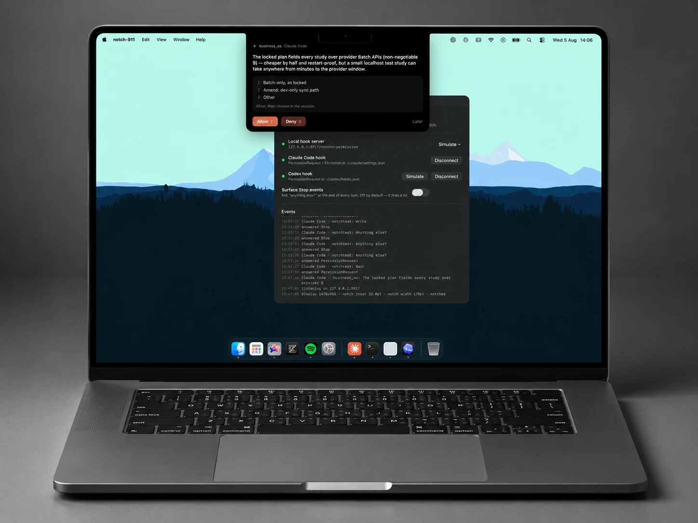
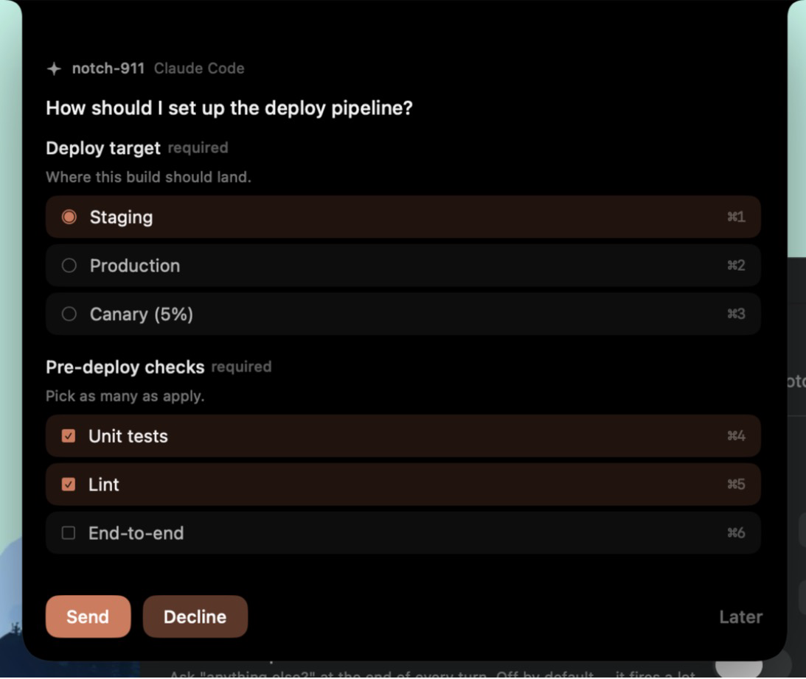
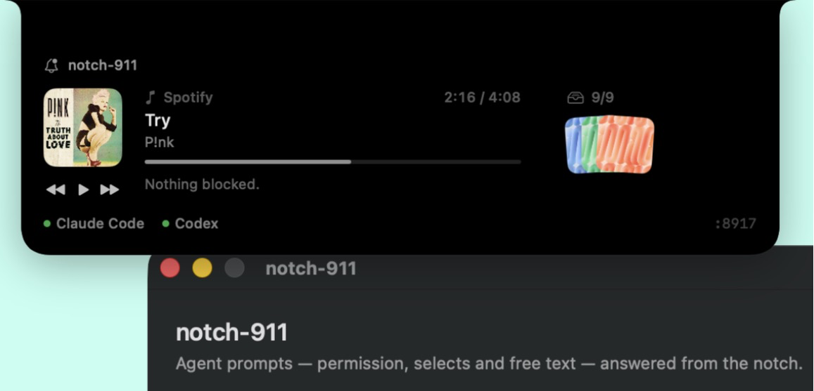
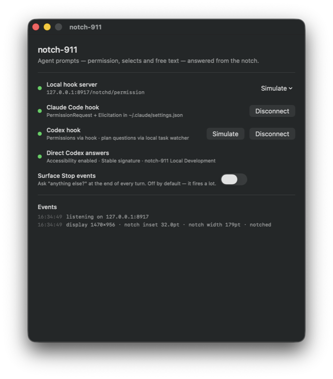

<div align="center">


# notch-911

**Answer your coding agents from the MacBook notch.**


&nbsp;&nbsp;

&nbsp;&nbsp;

&nbsp;&nbsp;

&nbsp;&nbsp;


macOS 14+ &nbsp;·&nbsp; Swift 6 &nbsp;·&nbsp; SwiftUI + AppKit

</div>

---

Claude Code and Codex both stop and wait for you — for permission, for a choice,
for a plan-mode answer. notch-911 puts those prompts in the notch, so you answer
them without leaving the window you were already in. While nothing is asking,
the same surface shows what's playing and holds a shelf of files you're moving
between apps.

<div align="center">
  
</div>

---

## What it does

### Agent prompts, in the notch

A hook fires, the notch opens, you answer, the agent unblocks. Four shapes are
supported, covering everything the two agents can actually put in front of you:

| Prompt | Hook | Claude Code | Codex |
| --- | --- | :---: | :---: |
| Allow / deny | `PermissionRequest` | ✅ | ✅ |
| Selects + **Other** | `AskUserQuestion` | ✅ | — |
| Selects + text fields | `Elicitation` | ✅ | — |
| Free text | `Stop` | ✅ | ✅ |

The panel takes keystrokes without stealing focus and floats above fullscreen
apps, so answering never switches your active window.

<div align="center">
  
  <br>
  <sub>An <code>Elicitation</code> form — one single-select group, one
  multi-select group, every option on its own Command-number shortcut.</sub>
</div>

### Direct Codex answers

Codex plan-mode questions aren't hooks — they're App Server calls. notch-911
watches Codex's own rollout logs in `~/.codex/sessions` to notice an unresolved
question, then answers it by driving the real controls in the already-open Codex
window through macOS Accessibility.

It does **not** activate Codex, write to its rollouts, or manufacture
`function_call_output` records. The form stays open until Codex records the real
output. If submission fails, your answers are left intact and **Open Codex** is
offered as a fallback.

Grant access from the status window under **Direct Codex answers → Enable**, or
in **System Settings → Privacy & Security → Accessibility**.

### Now playing


&nbsp;·&nbsp;

&nbsp;·&nbsp;

&nbsp;— artwork and transport controls.

This is deliberately not a general "whatever is playing" reader. Since macOS
15.4, `mediaremoted` gates now-playing behind an entitlement third-party apps
can't obtain, so each app is read through its own scripting dictionary instead.
YouTube Music has no dictionary — it's read through whichever browser is showing
it, via `navigator.mediaSession`. That route reads every tab's URL and needs
*Allow JavaScript from Apple Events* enabled in the browser, so it sits behind a
setting that is **off by default**.

### File shelf

A temporary parking space: drag files in from anywhere, drag them back out
later. Nine slots — what fits a 3-column grid without the peek growing taller
than the surface it lives in.

Dropped files are **copied** into Application Support rather than referenced. A
shelf of references breaks the moment the original is moved or cleaned up, and
drags out of browsers and Mail hand over temp files that vanish almost
immediately.

<div align="center">
  
  <br>
  <sub>Nothing waiting on you: now playing on the left, the shelf on the right,
  both agents connected.</sub>
</div>

---

## The status window

Server state, which hooks are registered, and everything that has come through.
Closing it doesn't quit the app — it stays running as a background listener.

<div align="center">
  
</div>

---

## How it works

```
Claude Code ─┐                  ┌─ NotchPanel  (transparent NSPanel over the notch)
             ├─ HTTP ─→ HookServer ─→ PromptCoordinator
Codex shim ──┘        (loopback)     └─ StatusView   (server + hook status)

~/.codex/sessions ─→ CodexPlanQuestionWatcher ─→ CodexAccessibilityBridge ─→ Codex.app
```

**HookServer** is a hand-rolled HTTP/1.1 listener on loopback, built on
Network.framework rather than NIO or Vapor — it handles a handful of requests a
minute from a single local client, with `Connection: close` on every response so
there's no keep-alive state. The agent POSTs an event and *blocks on the
response body* until you decide.

**Hook registration** differs per agent:

- **Claude Code** — entries are merged into `~/.claude/settings.json` under a
  `/notchd/` path prefix. Merge, never overwrite: every write is preceded by a
  timestamped backup, and the file's `0600` mode is restored afterwards, since
  atomic writes replace the inode and would otherwise leave it world-readable.
- **Codex** — hook handlers are `command`-only, with no `http` variant. So
  notch-911 writes one small shim per event that relays stdin to the same
  loopback endpoint and echoes the decision back. Shims live in Application
  Support, not the app bundle: the bundle path moves between DerivedData and
  `/Applications`, and a stale absolute path would be a silent no-op.

Endpoints: `/notchd/permission`, `/notchd/elicitation`, `/notchd/stop`,
`/notchd/codex-permission`, `/notchd/codex-stop`.

**The notch surface** is one fixed-size transparent panel created at launch and
never moved or resized — AppKit frame animation isn't synchronised to the
SwiftUI render loop and tears at 120Hz, so only the SwiftUI content animates. A
separate sliver of a panel handles hover, which lets the content panel be
ordered out entirely when idle.

AppleScript runs out of process via `osascript` rather than `NSAppleScript`; the
latter is main-thread-only, and a 10–20 ms Apple Event round trip on the main
thread would blow the frame budget mid-animation.

---

## Build and install

For day-to-day development builds, use the repo's persistent local signing
identity and installer:

```sh
./scripts/install-local-signing-identity.sh
./scripts/build-install-local-signed.sh --reset-accessibility
```

The first is one-time setup and may ask for your login Keychain password to
authorize Apple's signing tools.

The second builds with `notch-911 Local Development`, verifies the signature and
designated requirement, backs up the current app under
`~/Library/Application Support/notch-911/Backups`, safely replaces
`/Applications/notch-911.app`, and launches it.

Use `--reset-accessibility` only for the first migration from stale ad-hoc
builds — grant Accessibility once after that launch, then use the same command
without the flag.

> The certificate is local to this Mac and is for development only. A
> distributed release should use Apple Development or Developer ID signing.

A stable code signature matters here: Accessibility permission is bound to the
signing identity, so ad-hoc rebuilds would silently drop the grant every time.

---

## Permissions

| Permission | Why | When |
| --- | --- | --- |
| **Accessibility** | Operate controls in the Codex window to submit answers | Direct Codex answers |
| **Automation** (Apple Events) | Read and control Music.app / Spotify | First now-playing use |
| **Automation** (browser) | Read YouTube Music via `navigator.mediaSession` | Off by default |

---

## Verification

```sh
xcodebuild test -project notch-911.xcodeproj -scheme notch-911 \
  -destination 'platform=macOS' CODE_SIGNING_ALLOWED=NO
```

The suite covers rollout parsing and completion, stale calls, option
descriptions, semantic Accessibility matching, nested pressable controls,
paginated Command-number sequences, cancellation, **Other** text entry,
submission controls, signature diagnostics, and safe failures.

The app deliberately does **not** start its server under XCTest — doing so would
bind a port and rewrite the *installed* app's hook registration out from under
it, silently disconnecting the notch on every test run.

---

## Project layout

```
notch-911/
  notch_911App.swift               App entry, background-listener lifecycle
  AppModel.swift                   Wiring and app-wide state
  HookServer.swift                 Loopback HTTP/1.1 listener
  HookModels.swift                 Hook wire format
  PromptModels.swift               Generalised prompt model
  PromptCoordinator.swift          Prompt queue and resolution
  NotchPanel.swift                 The notch surface
  StatusView.swift                 Status window
  MediaController.swift            Music / Spotify / YouTube Music
  FileShelf.swift                  Drag-in / drag-out shelf
  BrandMark.swift                  Service marks from the asset catalog
  ClaudeSettings.swift             ~/.claude/settings.json merge
  CodexSettings.swift              Codex shim registration
  CodexPlanQuestionWatcher.swift   Rollout-log watcher
  CodexAccessibilityBridge.swift   Accessibility submission
  CodeSignatureInspector.swift     Signing diagnostics
notch-911Tests/                    Five suites
scripts/                           Signing identity, installer, icon generator
docs/images/                       README assets
```

---

## Limitations

- Codex has no elicitation hook, so select/multi-select forms are Claude Code
  only. `Stop` is the one place Codex takes free text back.
- The Electron *YouTube Music Desktop* build isn't scriptable and isn't covered.
- On a Mac with no notch, the panel falls back to the top edge of the screen.

---

<div align="center">
<sub>Service marks belong to their respective owners and are used to identify the
apps notch-911 talks to.</sub>
</div>
